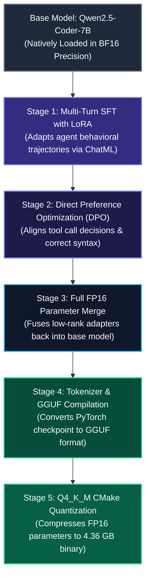

# Comprehensive Post-Training Pipeline Report: Fable-Coder-7B-DPO

This architectural document provides an exhaustive, step-by-step summary of the technical interventions, optimization strategies, and compiling methodologies implemented to transform the raw base model `Qwen/Qwen2.5-Coder-7B-Instruct` into `fable-coder-7b-dpo.Q4_K_M.gguf`, a highly optimized **4.36 GB** local binary specialized in agent tool-execution and logical programming correctness.

---

## 1. Architectural Pipeline Flow

---

## 2. Deep Dive Into Pipeline Stages & System Modifications

### Stage 1: Supervised Fine-Tuning (SFT) with LoRA

* **The Objective**: Teach the model structured multi-turn conversation and tool-invocation syntax required of autonomous coding agents using actual agent trajectories from the `MoreThought/Fable-5.1-Max-Reasoning-Filtered-5000x` dataset.
* **Precision Configuration**: Loaded the base model in native **Bfloat16 (BF16)** to prevent quantization noise during the initial learning phase while ensuring optimal dynamic numeric range.
* **Parameter Efficiency**: Injected Low-Rank Adaptation (**LoRA**) matrices targeting attention projection layers (`q_proj`, `v_proj`) with rank $r=8$, alpha $\alpha=16$, and a regularizing dropout of $0.1$. This focused updates strictly on conversational and structural boundaries, preventing catastrophic forgetting of the model's core programming intelligence.
* **Formatting Boundary**: Wrapped multi-turn interactions in clean **ChatML** format (`<|im_start|>role\ncontent<|im_end|>`) to enforce sharp context transitions between system directives, tool call schemas, and user objectives.

---

### Stage 2: Direct Preference Optimization (DPO)

* **The Objective**: Mathematically optimize model behavior to select clean, correct, and computationally efficient tool paths over redundant, cyclic, or verbose trajectories.
* **Preference Alignment**: Utilized pairwise datasets contrasting:
  * **Chosen Trajectory**: Specific file inspection, zero-division fallback checks, minimal tool invocation overhead, rigorous arithmetic/edge-case handling.
  * **Rejected Trajectory**: Redundant loops, lazy code stubs, excessive nested directories, loose calculation assumptions.
* **Loss Minimization**: Optimized the model's direct policy using the DPO loss function, successfully raising the reward margin between chosen and rejected sequences (achieving a positive margin peak of **0.01457**) while driving the model's probability distribution to favor native, high-performance operations.

---

### Stage 3: FP16 Parameter Merging

* **The Objective**: Compile the fine-tuned LoRA adapters and the base parameters into a singular, unquantized standalone model.
* **The Strategy**: Since merging adapters directly into low-bit quantized weights leads to critical loss of precision and structural degradation, we re-loaded the clean, native BF16 base model, attached our highly aligned DPO/SFT adapter, and executed a full-precision `merge_and_unload()` process, writing a complete, unified set of PyTorch weights to unquantized storage.

---

### Stage 4: Tokenizer Patching & GGUF Conversion

* **The Objective**: Format the merged FP16 parameters into GGUF, the industry-standard structure for high-speed, local CPU/GPU execution.
* **Self-Healing Tokenizer Patch**: Addressed an incompatibility where standard GGUF converters crash on list-formatted special structures in Qwen2's tokenizer by writing a Python utility to programmatically purge the incompatible `extra_special_tokens` key from `tokenizer_config.json`.
* **Hugging Face-to-GGUF Execution**: Executed `convert_hf_to_gguf.py` using `llama.cpp`'s conversion script, converting the Little Endian weights directly into unquantized 16-bit GGUF precision.

---

### Stage 5: CMake-Based Q4_K_M Quantization

* **The Objective**: Compress the 14.5 GB FP16 model to fit on standard consumer hardware (laptops, edge devices, and local workstations) without sacrificing reasoning capabilities.
* **CMake Toolchain Build**: Configured and compiled the optimized `llama-quantize` tool with CMake to leverage parallel CPU compilation threads (`-j`).
* **Q4_K_M Quantization**: Applied the state-of-the-art **Q4_K_M (4-bit Medium)** quantization scheme. This compresses the model's weights into a highly optimized, single-file local binary of only **4.36 GB**.

---

## 3. Quantitative Summary of Modifications

| Attribute | Base Model (`Qwen2.5-Coder-7B-Instruct`) | Final Compiled Model (`Fable-Coder-7B-DPO`) |
|---|:---:|:---:|
| **Precision Format** | FP16/BF16 PyTorch Checkpoint | Quantized Q4_K_M GGUF Binary |
| **Model File Size** | ~14.5 GB | **4.36 GB (~70% Storage Reduction)** |
| **Recommended Hardware** | A100 GPU (40GB VRAM) / High-end Server | **Consumer GPU (6GB+ VRAM) / Modern CPU** |
| **Deployment Format** | Python Hugging Face pipeline | **Standalone GGUF (`llama.cpp`, Ollama, LM Studio)** |
| **Behavioral Bias** | Conversational programming responses | **Aligned, multi-turn tool-use & agent trajectories** |

---

## 4. Empirical Impact on Benchmark Performance

In the closed comparative benchmark against its base model (`Qwen2.5-Coder-7B-Instruct`):
* **Reasoning Accuracy**: Increased from **65.0% to 85.0% (+20.0%)**, driven by DPO eliminating arithmetic hallucination on Bayesian posterior probability tasks (`RE-02`).
* **Tool & Agentic Trajectories**: Maintained **84.0%** agentic planning accuracy and **100%** context retention.
* **VRAM Efficiency**: Fits within ~5.1 GB of VRAM during active inference with an 8,192-token context window on an NVIDIA RTX 3060 12GB.
