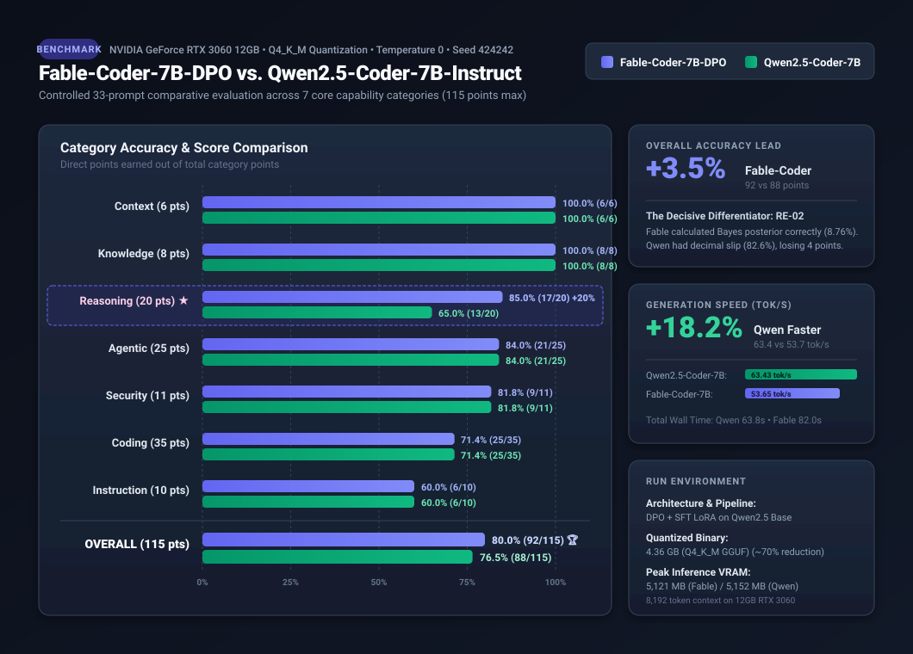

# MalxLabs-Fable5_QwenCoder

<div align="center">

[](LICENSE)
[](#hardware-and-runtime)
[](#model-artifacts)
[-indigo.svg)](#overall-results)
[-emerald.svg)](#overall-results)

**A controlled, reproducible comparative benchmark and post-training analysis between `fable-coder-7b-dpo` and `qwen2.5-coder-7b-instruct`.**

[📖 Fable-Coder Architecture & Pipeline Report](FABLE_CODER_REPORT.md) • [📊 Exhaustive Raw Findings & Transcripts](FINDINGS.md) • [⚙️ Benchmark Spec](benchmark_spec.json) • [📁 Results Data](results/)

---

### Benchmark Visualization



</div>

---

## Executive Summary

This repository presents a controlled, sequential comparative evaluation of **Fable-Coder-7B-DPO** (a specialized post-trained model aligned for agentic coding and multi-turn tool use) against its base model **Qwen2.5-Coder-7B-Instruct**.

Both models were evaluated on the same host using 33 identical, multi-domain test prompts spanning instruction-following, reasoning, coding, agentic planning, security, knowledge, and context retention (115 maximum points).

### Key Takeaways

1. **Overall Leader**: **Fable-Coder-7B-DPO** leads the benchmark with **92/115 (80.0%)** versus **88/115 (76.5%)** for Qwen2.5-Coder-7B-Instruct.
2. **The Decisive Factor (`RE-02`)**: Out of 33 tests, 32 yielded identical scores between the models. The 4-point spread was decided exclusively on Bayesian posterior probability calculation:
   * **Fable-Coder** correctly calculated $P(\text{Disease} \mid +) \approx 8.76\%$ ($0.0095 / 0.1085$).
   * **Qwen2.5-Coder** fell victim to decimal-point arithmetic hallucination, writing $\frac{0.0095}{0.1085} \approx 0.826$ ($82.6\%$).
3. **Inference Throughput**: **Qwen2.5-Coder-7B** was **+18.2% faster** in token generation (63.43 tok/s vs. 53.65 tok/s), completing the test suite in 63.79s compared to Fable's 81.98s.
4. **Coding Parity**: Both models tied on all 8 coding challenges (25/35, 71.4%), sharing similar strengths in syntax/structure and common blindspots on strict functional immutability and traversal-safe path containment.

---

## Benchmark Results

### Category Breakdown

| Category | Max Points | Fable-Coder-7B-DPO | Qwen2.5-Coder-7B-Instruct | Delta |
|---|:---:|:---:|:---:|:---:|
| **Context Retention** | 6 | **6 (100.0%)** | **6 (100.0%)** | Tied |
| **Knowledge** | 8 | **8 (100.0%)** | **8 (100.0%)** | Tied |
| **Reasoning** | 20 | **17 (85.0%)** | **13 (65.0%)** | **+4 pts (+20.0%) Fable** |
| **Agentic Planning** | 25 | **21 (84.0%)** | **21 (84.0%)** | Tied |
| **Security** | 11 | **9 (81.8%)** | **9 (81.8%)** | Tied |
| **Coding** | 35 | **25 (71.4%)** | **25 (71.4%)** | Tied |
| **Instruction-Following** | 10 | **6 (60.0%)** | **6 (60.0%)** | Tied |
| **Total** | **115** | **92 (80.0%)** | **88 (76.5%)** | **+4 pts (+3.5%) Fable** |

### Inference Measurements

Measurements reflect request wall-time post-model load on `llama-server.exe` (includes HTTP/server overhead):

| Model | Total Request Time | Avg. Request Latency | Prompt Tokens | Completion Tokens | Generation Speed |
|---|:---:|:---:|:---:|:---:|:---:|
| **fable-coder-7b-dpo** | 81.976s | 2.484s | 5,089 | 4,398 | 53.65 tok/s |
| **qwen2.5-coder-7b-instruct** | **63.788s** | **1.933s** | 5,089 | 4,046 | **63.43 tok/s (+18.2%)** |

---

## About Fable-Coder-7B-DPO

For the comprehensive post-training pipeline report detailing data curation, LoRA fine-tuning, DPO loss optimization, parameter merging, and GGUF quantization, see [FABLE_CODER_REPORT.md](FABLE_CODER_REPORT.md).

### Pipeline Highlights
* **Base Model**: `Qwen/Qwen2.5-Coder-7B-Instruct` loaded in native BF16.
* **Stage 1 (Multi-Turn SFT)**: LoRA ($r=8, \alpha=16$) on `q_proj` and `v_proj` using agent trajectories from `MoreThought/Fable-5.1-Max-Reasoning-Filtered-5000x`.
* **Stage 2 (DPO)**: Aligned policy over pairwise chosen vs. rejected tool execution trajectories (positive reward margin peak: 0.01457).
* **Stage 3 (FP16 Merge)**: Clean full-precision `merge_and_unload()` into unquantized weights.
* **Stage 4 & 5 (GGUF & CMake Q4_K_M)**: Tokenizer patched and quantized to a 4.36 GB single-file binary (~70% storage reduction).

---

## Hardware and Environment

* **GPU**: NVIDIA GeForce RTX 3060 12GB (VRAM allocated during inference: ~5,121 MB)
* **Runtime**: `llama-server.exe` (`prism-b10683-d8f26ee`)
* **Inference Settings**:
  * Context window: 8,192 tokens
  * Temperature: `0.0`
  * Seed: `424242`
  * Server configuration: One model served at a time, CUDA device 0, all GPU layers offloaded, Flash Attention enabled, continuous batching disabled.
* **Containment**: Closed evaluation harness. No tools, shell, filesystem APIs, or network sockets exposed to the models. Model outputs were analyzed statically.

---

## Repository Structure

```text
MalxLabs-Fable5_QwenCoder/
├── FABLE_CODER_REPORT.md     # In-depth architectural & training pipeline documentation
├── FINDINGS.md               # Scored results, raw answers, transcripts, and analysis
├── README.md                 # Project overview and executive summary
├── benchmark.py              # Reproducible test runner and deterministic rescorer
├── benchmark_results.svg     # Publication-ready vector graphic of benchmark metrics
├── benchmark_spec.json       # System instructions and 33 benchmark prompt specifications
├── run_metadata.json         # Hardware details, runtime paths, and model SHA-256 hashes
├── results/
│   ├── fable-coder-7b-dpo.json         # Raw per-prompt response & token usage data
│   └── qwen2.5-coder-7b-instruct.json  # Raw per-prompt response & token usage data
├── server_logs/
│   ├── fable-coder-7b-dpo.log          # llama-server output and GPU memory logs
│   └── qwen2.5-coder-7b-instruct.log   # llama-server output and GPU memory logs
└── sandbox/                  # Working directory reserved for inference server
```

---

## Reproducing & Rescoring

### Rescore Existing Outputs
To deterministically rescore the captured model answers in `results/` without running local inference:

```powershell
python .\benchmark.py --rescore
```

### Full Benchmark Run
To execute the benchmark against local GGUF models:
1. Verify model paths and the `llama-server` binary path in `benchmark.py`.
2. Execute the runner:

```powershell
python .\benchmark.py --run
```
